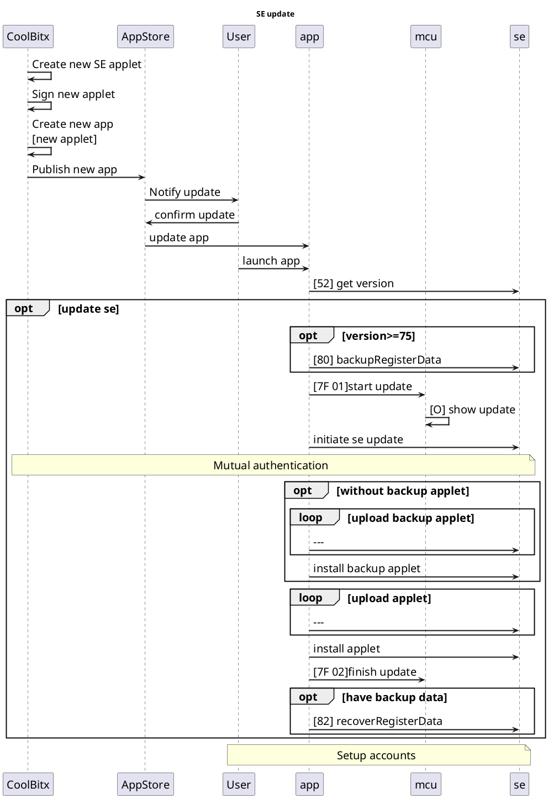

```plantuml
@startuml
skinparam DefaultFontSize 20
skinparam sequenceArrowThickness 2
title SE update

participant CoolBitx as cb
participant AppStore as as
participant User as u
participant app as a
participant mcu as m
participant se as s

cb->cb: Create new SE applet
cb->cb: Sign new applet
cb->cb: Create new app\n[new applet]
cb->as: Publish new app
as->u: Notify update
u->as: confirm update
as->a: update app
u->a: launch app
a->s: [52] get version
opt update se
opt version>=75
a->s: [80] backupRegisterData
end opt
a->m: [7F 01]start update
m->m: [O] show update
a->s: initiate se update
note over cb,s
Mutual authentication
end note
opt without backup applet
loop upload backup applet
a->s: ---
end loop
a->s: install backup applet
end opt
loop upload applet
a->s: ---
end loop
a->s: install applet
a->m: [7F 02]finish update
opt have backup data
a->s: [82] recoverRegisterData
end opt
end
note over u,s: Setup accounts
@enduml
```
 
